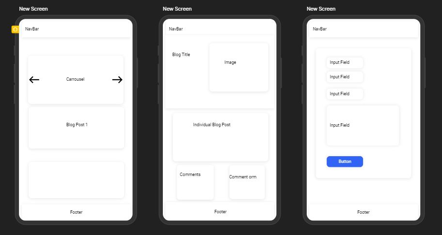
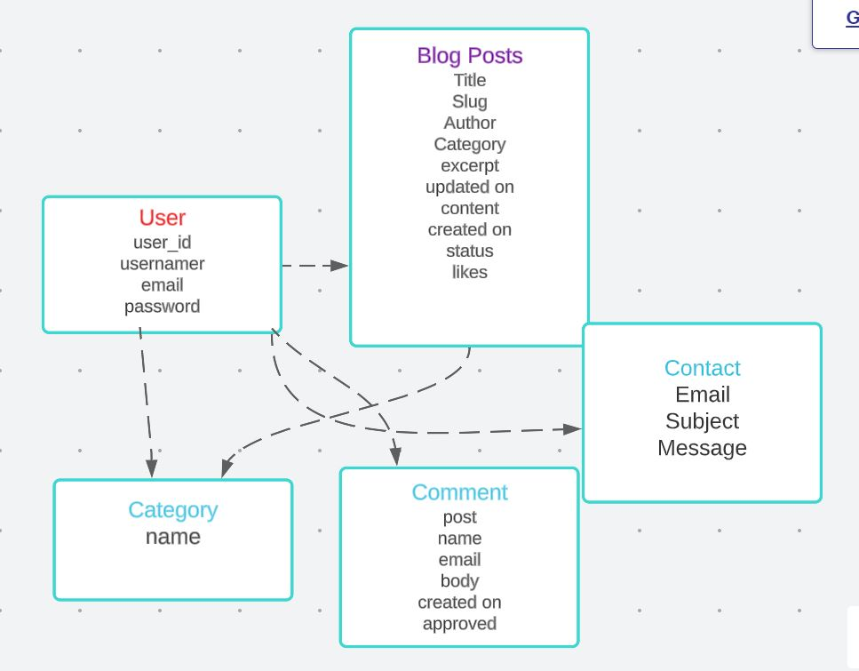
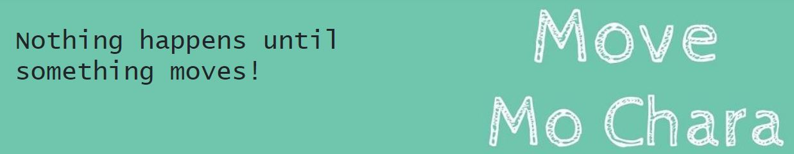
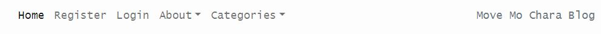
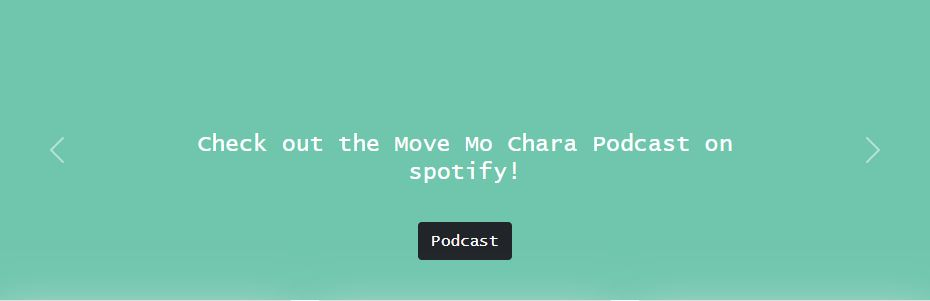
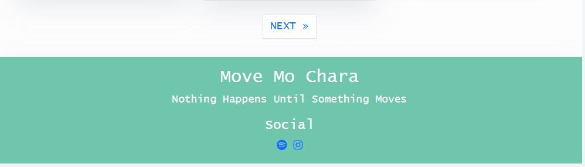

# **Move Mo Chara Blog**

Move Mo Chara Blog was created to help be a hub for my friend Carly's passion project, Move Mo Chara Podcast. Move Mo Chara came about because Carly is passionate about movement in all forms and she has a natuaral ability to be able to hold the audience captive thoughout the interview. The podcast is more focused on the movement of body, however, Carly has a natural curiostiy about movement in all shapes and forms from moving abroad, careers and travel and most of all, challenging herself to move out of her comfort zone. I wanted to help my friend create a hub where she can experss herself to expand beyond the podcast and blog her adventures to her audience. 

You can view the live site here - <a href="https://move-mmc.herokuapp.com/" target="_blank"> Move Mo Chara Blog </a>

# User Experience (UX)

## Strategy

### The Business Goals of the Website

To expand Move Mo Chara podcast into a lifestyle blog where Carly can share more of her personal story with the audience. The site will be a natural evoluntion of the podcast and allow Carly to expand her passion of movement beyond that of movement of the body. Here she will be able to share her stories and in time hopefully use this to collaborate with brands and use this website as a income based site. 

### User Stories 

* __Site User Goals:__

  * As a Site user I can view the blog posts
  * As a Site user I can select a blod to "read more"
  * As a Site User I can register an account so that I can comment and like
  * As a Site User I can interact with the content once logged in by liking or commenting on a post
  * As a Site User I can leave comments on a post so that I can be involved in the conversation posted
  * As a Site User/Admin I can view comments on an individual post so that I can see how site visitors are responding to the content
  * As a Site User/Admin I can view the number of likes on each post so that I can see which is the most popular with site visitors
  * As a Site User I can locate social media accounts associated with the blog so I can learn more about the blog
  * As a Site User I can navigate easily through the site and find the relevant information with ease
  * As a Site User I can learn about the purpose and focus of the blog
  * As a Site User I can select to view blogs via a category I am interested in
  * As a Site User I can contact the site owner regarding any feedback or queries
  
* __Site Owner Goals:__

  * As a Site Admin I can approve/disapprove comments so that I can control the narrative of the site
  * As a Site Admin I can create draft posts so that I can finish writing the content later
  * As a Site Admin I can create, read, update and delete posts so that I can manage content
  * As a Site User/Admin I can view comments on an individual posts so that I can see how visitors to the site are responding to the content
  * As a Site User/Admin I can view the number of likes on each post so that I can see which is the most popular or viral
  * As a Site Admin I can prevent unauthorised users from having access so that they cannot access admin content or other users' profiles
  * As a Site admin I can add categories for visitors to search posts of interest to them
  * As a Site admin I can approve comments 

## Scope 

To achieve the strategy goals create for the site, I wanted to implement the following features:

* A navigation bar at the top of the site that is responsive to user of the site and that is intuitive to the user
* A Home section which will allow the user to find out about the website and view posts.
* An About Us page to inform the user about this website.
* A Login page for existing users to access their account to allow to like and add comments.
* A Register/Signup page to allow new users to create an account.
* A Blog post page to view the selected post in more detail for the recipes and add comments/like the post.
* A Footer located at the bottom of the website which allows the user to access social media links.
* A fully responsive design that will work on different devices including desktop, tablets, and mobile devices, allowing users to access the site anytime and anywhere.
* An Error 404 Page to allow users to redirect back to Home page in case of any errors.
* A Contact oage to allow users to leave any feedback or queries.
* Full CRUD functionality for Admin to allow to create, read, update and delete posts.

### Agile Methodology

The Agile Methodology was used to plan this project. This was implemented through Github and developed throughout the project. 

Through the use of the Kanban board in the projects view in Github, the project was divided into a few different sections:

Github issues were used to create User Stories for the project. This is where the project user was assigned; labels were added to show at a glance importance of tasks and help prioritize jobs. User story was added to the appropriate Iteration and the project.

## Structure

## Design

The design was centered around the Move Mo Chara Podcast design that Carly had created when she began the podcast. 

The graphic paired with the green is a perfect mix that will hold the test of time and not outdate. 

## Skeleton 

### Wireframes 
Move Mo Chara Blog was heavily influenced by the I think therefor I blog walk through. I took aspects of what I liked about this and personalized it 
to how I like to view information. The layout is extremly simply. A main page with blog post, a blog post page where you can read an article and a forms page where you can login
and out or submit comments or get in touch. I built the blog from mobile first and then added bootstrap so that it is responsive. 

[Website Wire Frame](assets/readme_images/website_wireframe.JPG)

### Database modal

The database model is simple and follows along the basis of the I think therefore I blog database structure. There is user, blogpost, comments and category sections that are used to create the information on the site. The category model was created so that readers could go to posts that they have interest in or two see what is simlar to what they have already read. 

### Colours

A light green color was used as the main desing color and accented with with an off white and grey. When you look into the psychology of green it is the perfect primary color for the this blog.

Green is regarded as the most restful and relaxing colour to the human eye. It is a colour that can help you restore your depleted energy. If you are feeling too much stress due to modern living, the colour of green can serve as your sanctuary. This dominant colour of nature helps restore our sense of well-being.

Green is a generous, relaxing colour that revitalizes our body and mind. 

### Typography 

The typography that was used was chosen by Carly and is Roberto, Lato and sanserif as back up. I think they suit the blog and that it looks good in both the preview on the posts page and on the articles 

### Imagery 

Images were obtained from Carly's gallery with her permission to use them.

The great thing about using personal photos is that it relatable to the audience creating a connection with the user and a natural flow to the website. 

## Features ##

- ### Home Page Features ###

Below is a list of current features for the website. 

- #### Header ####
A basic header with the name of the blog and the containing the navigation. The header and navigation are across all pages on the site.
It is reponsive across all device widths.

- #### Navigation ####
A responsive navigation bar that easily allows the user to navigate the site on mobile, table and website. There are drop down buttons which are grouped together. One drop down for 'About Me' section and one drop down for the 'Categories' section. The was created using bootstrap respnsive navbars so on smaller devices it becomes a burger menu. 

- #### Carousel ####
There is a carosel that have arrows to slide foward our back. There is three slides all on a green background. The idea was to use photos but I found the main page busy
and like the solid green as a break point. Each slide has a button related to the owner, Carly, 'about me', 'contact me' and a external link to her podcast. 

- #### Main Page with blog posts  ####
The next container is the main section of the home page containing a maximum of six blog posts with photos, dates, excerpts and a read more button for the user to select a blog post to read.  

- #### Read More button
The read more allows the user to view the entire article of a blog post after reading he excerpt. 

[Blog post view website](assets/readme_images/blog_posts.JPG)

- #### Next/Previous Button ####
On mobile, tablet and web the main page shows six blog posts and then it will go to a new page. There was pagination added for the user to easlily be able to go back and forth between the pages. 

- #### Footer ####
The footer is simple and again it features the green which is consistent across the site. It contains links to Carly's Instagram page and to her Move Mo Chara podcast. It is consistent across all pages and responsive on all devices.  

- ### Blog Post Features ###

- #### Masthead ####
The masthead is used to break up the page for the reader. It contains the image and title details of the post.
[Masthead](assets/readme_images/masthead.JPG)

- #### Article Card #### 
The article content is placed in a card so there is a clear change from the masthead. The container is responsive and holds links to external sites. 

- #### Comments and Likes section  ####
Below the article section is where users are interact with the content and like posts, sign in and leave a comments for other users to see once approved by the admin. 
[Likes and comments](assets/readme_images/commes_likes_blog.JPG)

- #### Back Button
I added a back button to each article that links back to the home page. I know realise that it should go back to the previous page as now that I have added more than six blogs it would not be an ideal user experience. 

- ### Login, Sign Up, Comments pages ###
The login, sign up, logout and comment forms were all part of djangos batteries included and minimial styling was added to each. 
The sing up page was not responsive so I did place that in a card to make it responsive. 
[Sign Up Page](assets/readme_images/signup.JPG)

- ### Alert Messages
Alert messages are used to let members know when they have logged in, out and submitted a comment form. 

- ### About Me Page
I created the about me page so that the user could get to know Carly and her reasons for starting a blog. It carries across similar styles to 
the blog post page. 

- ### Contact Me Page
I created the contact me page as a way for the user to get in contact with Carly. It is styled the same as  When submitted the user will be taken back to the home page. I simply
ran out of time to set it up so that a success message will come through and that I could view it in the backend. 

- ## Admin Page 
The admin page can be accessed using /admin after the url https://move-mmc.herokuapp.com and it is an awesome feature of Django that I found worked great for a site like 
this where the owner is the sole writer of posts. 

- ## Future Features

- ### Contact Me Form
Wire it up correctly so that the user gets a message and the owner receives the email 

- ### Social Sign In
Allow users to sign in using their social accounts

- ### Expand Categories
Expand the Categories that users can search

- ### Back Button
Have the back button go the the previous page

# Technologies Used 

For this project the main languages used are __HTML5__, __CSS3__, __JavaScript__, __Python__, __Django__ and __Heroku Postgres__.

I have also utilised the following frameworks, libraries, and tools:

* [Bootstrap v5.1.3](https://getbootstrap.com/): 
    * Bootstrap has been used for overall responsiveness of the website and for the layout with the addition of select classes.
* [GitPod](https://www.gitpod.io/): 
    * I used GitPod as the IDE for this project and Git has been used for Version Control.
* [GitHub](https://www.github.com/): 
    * GitHub has been used to create a repository to host the project and receive updated commits from GitPod.
* [Uizard](https://uizard.io/): 
    * I used Uizard to create the wireframes for the site.
* [Figma](https://www.figma.com/): 
    * I used Figma to create the database diagram model for the site.
* [Google Fonts](https://getbootstrap.com/): 
    * I have used Google Fonts to import fonts for styling purposes for this project.
* [Font Awesome](https://fontawesome.com/): 
    * Font Awesome was used to apply icons in the Home, Exercises and Footer sections.
* [Chrome Dev Tools](https://developers.google.com/web/tools/chrome-devtools): 
    * Chrome Dev Tools was used to test the site, assist with debugging issues and run reports from Lighthouse.
* [W3C Markup Validation Service](https://validator.w3.org/): 
    * The W3C Markup Validation Service was used to validate the HTML document for this project and to identify any issues with the code.
* [W3C CSS Validation Service](https://jigsaw.w3.org/css-validator/): 
    * The W3C CSS Validation Service was used to validate the CSS document for this project and to identify any issues with the code.
* [PEP8CI](https://pep8ci.herokuapp.com/): 
    * The PEP8 Online Validation Service created by Code Institute was used to validate the Python document for this project and to identify any issues with the code.
* [Heroku](https://www.heroku.com/): 
    * Heroku has been used to create a repository to host the project and receive updated commits from GitPod.
* [Django](https://docs.djangoproject.com/en/3.1/): 
    * Django was used as the main framework to build this project.
* [Cloudinary](https://cloudinary.com/): 
    * Cloudinary was used to store all media and static files for this project.
* [Am I Responsive](http://ami.responsivedesign.is/):
    * Am I Responsive was used to create the header image for the README file.
* [Python](https://www.python.org/): 
    * Various Python modules were used to build this project as detailed below and as seen in the requirements.txt file.

# Deployment

This project was deployed using Github and Heroku.

- ## Github 

    * To create a new repository, I took the following steps:

        + Logged into GitHub.
        + Click the ‘repositories’ section.
        + Click the green ‘new’ button to create new repository.
        + Choose ‘repository template’ Used the code institute template as recommended from the dropdown menu.
        + Add repository name then clicked the green ‘create repository button’ at the bottom of the page.
        + Open the new repository and clicked the green ‘Gitpod’ button to create a workspace in Gitpod for editing.

- ## Django, Elephant SQL and Heroku Heroku

    To get the Django framework installed and set up I followed the Code institutes [Django I Think Therefore I Blog cheatsheet](https://docs.google.com/document/d/1P5CWvS5cYalkQOLeQiijpSViDPogtKM7ZGyqK-yehhQ/edit). & Revisited the Walkthrough to assist.
    
    #### Final Deployment 
    DEBUG = False

    X_FRAME_OPTIONS = 'SAMEORIGIN' 

    In Heroku go to Reveal Congfig Vars  
    Remove Disbable_Collectstatic

    Go to Deploy Tab & Deploy Branch
   
- ## Clone Project 

    * Cloning of Project was made possible by GitHub
        + Go to Git Hub
        + Go to the repository 
        + Click on it to go to main repository site 
        + Click on the Code drop down button menu next to the greeen Gippod button
        + Click on HTTP section you will see the http of the repository click on the window next to it it will say copied
        + Clikced on Download and Zip
        + Clicked on Open with GitHubDesktop
 