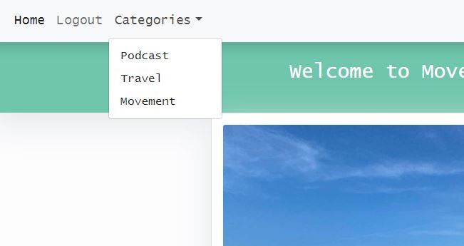
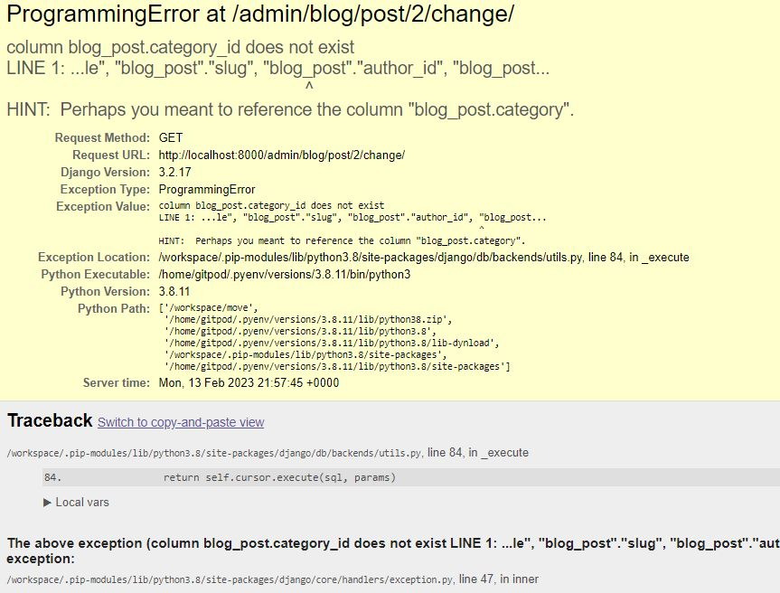

# **Move Mo Chara Blog**

[Move Mo Chara Blog](https://move-mmc.herokuapp.com/)

Move Mo Chara Blog was created to help be a hub for my friend Carly's passion project, Move Mo Chara Podcast. Move Mo Chara came about because Carly is passionate about movement in all forms and she has a natuaral ability to be able to hold the audience captive thoughout the interview. The podcast is more focused on the movement of body, however, Carly has a natural curiostiy about movement in all shapes and forms from moving abroad, careers and travel and most of all, challenging herself to move out of her comfort zone. I wanted to help my friend create a hub where she can experss herself to expand beyond the podcast and blog her adventures to her audience. 

You can view the live site here - <a href="https://move-mmc.herokuapp.com/" target="_blank"> Move Mo Chara Blog </a>

# User Experience (UX)

## Strategy

### The Business Goals of the Website

To expand Move Mo Chara podcast into a lifestyle blog where Carly can share more of her personal story with the audience. The site will be a natural evoluntion of the podcast and allow Carly to expand her passion of movement beyond that of movement of the body. Here she will be able to share her stories and in time hopefully use this to collaborate with brands and use this website as a income based site. 

### User Stories 

* __Site User Goals:__

  * As a Site user I can view the blog posts
  * As a Site user I can select a blod to "read more"
  * As a Site User I can register an account so that I can comment and like
  * As a Site User I can interact with the content once logged in by liking or commenting on a post
  * As a Site User I can leave comments on a post so that I can be involved in the conversation posted
  * As a Site User/Admin I can view comments on an individual post so that I can see how site visitors are responding to the content
  * As a Site User/Admin I can view the number of likes on each post so that I can see which is the most popular with site visitors
  * As a Site User I can locate social media accounts associated with the blog so I can learn more about the blog
  * As a Site User I can navigate easily through the site and find the relevant information with ease
  * As a Site User I can learn about the purpose and focus of the blog
  * As a Site User I can select to view blogs via a category I am interested in
  * As a Site User I can contact the site owner regarding any feedback or queries
  
* __Site Owner Goals:__

  * As a Site Admin I can approve/disapprove comments so that I can control the narrative of the site
  * As a Site Admin I can create draft posts so that I can finish writing the content later
  * As a Site Admin I can create, read, update and delete posts so that I can manage content
  * As a Site User/Admin I can view comments on an individual posts so that I can see how visitors to the site are responding to the content
  * As a Site User/Admin I can view the number of likes on each post so that I can see which is the most popular or viral
  * As a Site Admin I can prevent unauthorised users from having access so that they cannot access admin content or other users' profiles
  * As a Site admin I can add categories for visitors to search posts of interest to them
  * As a Site admin I can approve comments 

## Scope 

To achieve the strategy goals create for the site, I wanted to implement the following features:

* A navigation bar at the top of the site that is responsive to user of the site and that is intuitive to the user
* A Home section which will allow the user to find out about the website and view posts.
* An About Us page to inform the user about this website.
* A Login page for existing users to access their account to allow to like and add comments.
* A Register/Signup page to allow new users to create an account.
* A Blog post page to view the selected post in more detail for the recipes and add comments/like the post.
* A Add Post page if you are a superuser 
* The ability to edit a post if you are a superuser 
* The ability to delete a post if you are a superuser 
* A Contact Me page so that a site visitor can contact admin and send a message
* A Footer located at the bottom of the website which allows the user to access social media links
* A fully responsive design that will work on different devices including desktop, tablets, and mobile devices, allowing users to access the site anytime and anywhere
* A Contact page to allow users to leave any feedback or queries
* Full CRUD functionality for Admin to allow to create, read, update and delete posts

### Agile Methodology

The Agile Methodology was used to plan this project. This was implemented through Github and developed throughout the project. 

Through the use of the Kanban board in the projects view in Github, the project was divided into a few different sections - To Do, In Progress and Done. 

Github issues were used to create User Stories for the project. This is where the project user was assigned; labels were added to show at a glance importance of tasks and help prioritize jobs. User story was added to the appropriate Iteration and the project [Kanban Board](https://github.com/users/ciaralynch72/projects/4/views/1).

## Structure

## Design

The design was centered around the Move Mo Chara Podcast design that Carly had created when she began the podcast. 

The graphic paired with the green is a perfect mix that will hold the test of time and not outdate. 

## Skeleton 

### Wireframes 
Move Mo Chara Blog was heavily influenced by the I think therefor I blog walk through. I took aspects of what I liked about this and personalized it 
to how I like to view information. The layout is extremly simply. A main page with blog post, a blog post page where you can read an article and a forms page where you can login
and out or submit comments or get in touch. I built the blog from mobile first and then added bootstrap so that it is responsive. 

[Website Wire Frame](assets/readme_images/website_wireframe.JPG)

### Database modal

The database model is simple and follows along the basis of the I think therefore I blog database structure. There is user, blogpost, comments, contact and category sections that are used to create the information on the site. The category model was created so that readers could go to posts that they have interest in or two see what is simlar to what they have already read. The contact model was created to all the user to send a message to the site admin.

### Colours

A light green color was used as the main desing color and accented with with an off white and grey. When you look into the psychology of green it is the perfect primary color for the this blog.

Green is regarded as the most restful and relaxing colour to the human eye. It is a colour that can help you restore your depleted energy. If you are feeling too much stress due to modern living, the colour of green can serve as your sanctuary. This dominant colour of nature helps restore our sense of well-being.

Green is a generous, relaxing colour that revitalizes our body and mind. 

### Typography 

The typography that was used was chosen by Carly and is Roberto, Lato and sanserif as back up. I think they suit the blog and that it looks good in both the preview on the posts page and on the articles 

### Imagery 

Images were obtained from Carly's gallery with her permission to use them.

The great thing about using personal photos is that it relatable to the audience creating a connection with the user and a natural flow to the website. 

## Features ##

- ### Home Page Features ###

Below is a list of current features for the website. 

- #### Header ####
A basic header with the name of the blog and the containing the navigation. The header and navigation are across all pages on the site.
It is reponsive across all device widths.

- #### Navigation ####
A responsive navigation bar that easily allows the user to navigate the site on mobile, table and website. There are drop down buttons which are grouped together. One drop down for 'About Me' section and one drop down for the 'Categories' section. The was created using bootstrap respnsive navbars so on smaller devices it becomes a burger menu. 

- #### Carousel ####
There is a carosel that have arrows to slide foward our back. There is three slides all on a green background. The idea was to use photos but I found the main page busy
and like the solid green as a break point. Each slide has a button related to the owner, Carly, 'about me', 'contact me' and a external link to her podcast. 

- #### Main Page with blog posts  ####
The next container is the main section of the home page containing a maximum of six blog posts with photos, dates, excerpts and a read more button for the user to select a blog post to read.  

- #### Read More button
The read more allows the user to view the entire article of a blog post after reading he excerpt. 

- #### Edit Post button
The edit button appears to users that are authenticated so that they can select to edit a post from the main page. 

- #### Delete Post button
The delete button appears to users that are authenticated on the edit post page so that they can choose to delete that post.

[Blog post view website](assets/readme_images/blog_posts.JPG)

- #### Next/Previous Button ####
On mobile, tablet and web the main page shows six blog posts and then it will go to a new page. There was pagination added for the user to easlily be able to go back and forth between the pages. 

- #### Footer ####
The footer is simple and again it features the green which is consistent across the site. It contains links to Carly's Instagram page and to her Move Mo Chara podcast. It is consistent across all pages and responsive on all devices.  

- ### Blog Post Features ###

- #### Masthead ####
The masthead is used to break up the page for the reader. It contains the image and title details of the post.
[Masthead](assets/readme_images/masthead.JPG)

- #### Article Card #### 
The article content is placed in a card so there is a clear change from the masthead. The container is responsive and holds links to external sites. 

- #### Comments and Likes section  ####
Below the article section is where users are interact with the content and like posts, sign in and leave a comments for other users to see once approved by the admin. 
[Likes and comments](assets/readme_images/commes_likes_blog.JPG)

- #### Back Button
I added a back button to each article that links back to the home page. I know realise that it should go back to the previous page as now that I have added more than six blogs it would not be an ideal user experience. 

- ### Login, Sign Up, Comments pages ###
The login, sign up, logout and comment forms were all part of djangos batteries included and minimial styling was added to each. 
The sing up page was not responsive so I did place that in a card to make it responsive. 
[Sign Up Page](assets/readme_images/signup.JPG)

- #### Alert Messages
Alert messages are used to let members know when they have logged in, out and submitted a comment form. 

- #### About Me Page
I created the about me page so that the user could get to know Carly and her reasons for starting a blog. It carries across similar styles to 
the blog post page. 

- #### Contact Me Page
The contact me page was created so that the user can submit a message to admin with a thank you message after successful completion

- ## Future Features

- ### Social Sign In
Allow users to sign in using their social accounts

- ### Expand Categories
Expand the Categories that users can search

- ### Back Button
Have the back button go the the previous page

- ### General Improvement
I look forward to developing my skills and learning more about django to improve this site for my friend. 

# Technologies Used

For this project the main languages used are __HTML5__, __CSS3__, __JavaScript__, __Python__, __Django__ and __Heroku Postgres__.

I have also utilised the following frameworks, libraries, and tools:

* [Bootstrap v5.1.3](https://getbootstrap.com/): 
    * Bootstrap has been used for overall responsiveness of the website and for the layout with the addition of select classes.
* [GitPod](https://www.gitpod.io/): 
    * I used GitPod as the IDE for this project and Git has been used for Version Control.
* [GitHub](https://www.github.com/): 
    * GitHub has been used to create a repository to host the project and receive updated commits from GitPod.
* [Uizard](https://uizard.io/): 
    * I used Uizard to create the wireframes for the site.
* [Figma](https://www.figma.com/): 
    * I used Figma to create the database diagram model for the site.
* [Google Fonts](https://getbootstrap.com/): 
    * I have used Google Fonts to import fonts for styling purposes for this project.
* [Font Awesome](https://fontawesome.com/): 
    * Font Awesome was used to apply icons in the Home, Exercises and Footer sections.
* [Chrome Dev Tools](https://developers.google.com/web/tools/chrome-devtools): 
    * Chrome Dev Tools was used to test the site, assist with debugging issues and run reports from Lighthouse.
* [W3C Markup Validation Service](https://validator.w3.org/): 
    * The W3C Markup Validation Service was used to validate the HTML document for this project and to identify any issues with the code.
* [W3C CSS Validation Service](https://jigsaw.w3.org/css-validator/): 
    * The W3C CSS Validation Service was used to validate the CSS document for this project and to identify any issues with the code.
* [PEP8CI](https://pep8ci.herokuapp.com/): 
    * The PEP8 Online Validation Service created by Code Institute was used to validate the Python document for this project and to identify any issues with the code.
* [Heroku](https://www.heroku.com/): 
    * Heroku has been used to create a repository to host the project and receive updated commits from GitPod.
* [Django](https://docs.djangoproject.com/en/3.1/): 
    * Django was used as the main framework to build this project.
* [Cloudinary](https://cloudinary.com/): 
    * Cloudinary was used to store all media and static files for this project.
* [Am I Responsive](http://ami.responsivedesign.is/):
    * Am I Responsive was used to create the header image for the README file.
* [Python](https://www.python.org/): 
    * Various Python modules were used to build this project as detailed below and as seen in the requirements.txt file.

# Testing

## Validation

### Html Validation

Html validation was done with [https://validator.w3.org/nu/](https://validator.w3.org/nu/). I had to test on the final deployed site as 
the template code for django was causing a lot of errors. The errors that flagged were mostly stray tags, I uses height="300px" in and 
image tag so I changed it to "300" and that solved it. 

### Python Validation

Python code was validated using [Code institues Python validator](https://pep8ci.herokuapp.com/#)

Only minor errors such as missing blank spacing or whitespace. These were rectified easily and no errors remained. 

### Lighthouse Testing

[Lighthouse testing](assets/readme_images/lighthouse.JPG)

## Manual Testing

In addition to the other tests, I have conducted a manual check list for myself to carry out to make sure that everything is working as intended.

| Status | **Navigation Bar - User Logged Out**
|:-------:|:--------|
| &check; | Clicking the navbar home button loads the home page
| &check; | The navbar shows the tabs Home, Register, Login, About and Categories tabs
| &check; | Clicking the Home tab on the navbar loads the home page
| &check; | Clicking the Register tab on the navbar loads the sign up page
| &check; | Clicking the Login tab on the navbar loads the login page
| &check; | Clicking the About tab on the navbar drops down the About Me, Contact and Podcast links
| &check; | Clicking the Categories tab on the navbar loads the Podcast, Travel and Movement links 

| Status | **Navigation Bar - User Logged In**
|:-------:|:--------|
| &check; | Clicking the navbar home button loads the home page
| &check; | The navbar shows the tabs Home, Logout, About and Categories Page
| &check; | Clicking the Logout tab on the navbar loads the Logout page
| &check; | Clicking the About tab on the navbar loads the About Me, Contact and Podcast links and all load
| &check; | Clicking the categories in the navbar loads the Podcast, Travel and Movement categories and all load

| Status | **Footer - User Logged Out/In**
|:-------:|:--------|
| &check; | Clicking the instagram icon loads the MMC instagram in a new tab
| &check; | Clicking the spotigy icon loads MMC spotify page in a new tab

| Status | **Home Page**
|:-------:|:--------|
| &check; | The carosuel has a slider option than can be changed manually or that changes after 5seconds
| &check; | Newest blog post is the first visible and all blog post show a photo, excerpt and read more button for the user
| &check; | If more that six blog posts are created then a next/previous button will show
| &check; | If a user clicks read more they are brought to the article page

| Status | **Article Page**
|:-------:|:--------|
| &check; | That the page is the same page that the user clicked on
| &check; | That the image, title, article, comments and like sections show
| &check; | That if the user is logged in then they can leave a comment
| &check; | The user can like a post
| &check; | The user can click the back button to return home

| Status | **Form Pages - Login, logout, signup comment and contact**
|:-------:|:--------|
| &check; | That each input field is visible on all screens and are fillable 
| &check; | When the button is clicked and action is performed
| &check; | That the username input field is required
| &check; | That the password input field is required
| &check; | That if the username does not match the password the user cannot log in and user feedback is provided
| &check; | That if the correct credentials are given the user is logged in when the log in button is clicked

| Status | **/admin Access**
|:-------:|:--------|
| &check; | That when /admin is added to the URL and the admin is logged in that they will have full access to the build in django admin site
| &check; | Permisison is restricted to only super users
| &check; | The admin has full CRUD functionality in the admin panel

This website was tested on the following browsers by a number of kind volunteers:

* Google Chrome
* Safari
* Mozilla Firefox

This website was also tested on the following devices:

* iPhone 11 Pro
* iPhone 12 Pro
* iPad Pro
* Lenova laptop and 22" screen
* Samsung A52

## Bugs
I came across quite a few bugs while creating this project. A lot of them were typing errors, getting my URL paths correct, calling the wrong template, adding modules to installed apps. Alot of them actually helped me get a better understanding of what exactly I am at and they were important learning curves. 
My newly aquired bootstrap skills also were the fault of some bugs which I was able to rectify for the most part. 

* When I created my categories model and applied it to the navbar, no dropdown appeared. I was able to find the solution by adding data-bs-toggle="dropdown"

* I had issues creating my blog categories as I got them to show in the admin site but when I figured out how to show them on the site I had changed the names so it
kept showing errors. I was able to comment out the new category query, go back and delete old categories and start fresh. Not sure if this was the correct way to do this but it worked. 

### Known Bugs
* When you fill out the contact form, it shows in the terminal locally but I ran out of time to add EmailJS and get the alert messages to show. Right now it redirects the user
back to the main page but it is a poor user experience as they are unsure if there form went through or not. I will fix this for sure once I am done course. 

# Deployment

This project was deployed using Github and Heroku.

- ## Github 

    * To create a new repository, I took the following steps:

        + Logged into GitHub.
        + Click the ‘repositories’ section.
        + Click the green ‘new’ button to create new repository.
        + Choose ‘repository template’ Used the code institute template as recommended from the dropdown menu.
        + Add repository name then clicked the green ‘create repository button’ at the bottom of the page.
        + Open the new repository and clicked the green ‘Gitpod’ button to create a workspace in Gitpod for editing.

- ## Django, Elephant SQL and Heroku

    To get the Django framework installed and set up I followed the Code institutes [Django I Think Therefore I Blog cheatsheet](https://docs.google.com/document/d/1P5CWvS5cYalkQOLeQiijpSViDPogtKM7ZGyqK-yehhQ/edit). & Revisited the Walkthrough to assist.
    
    #### Final Deployment 
    DEBUG = False

    X_FRAME_OPTIONS = 'SAMEORIGIN' 

    In Heroku go to Reveal Congfig Vars  
    Remove Disbable_Collectstatic

    Go to Deploy Tab & Deploy Branch
   
- ## Clone Project 

    * Cloning of Project was made possible by GitHub
        + Go to Git Hub
        + Go to the repository 
        + Click on it to go to main repository site 
        + Click on the Code drop down button menu next to the greeen Gippod button
        + Click on HTTP section you will see the http of the repository click on the window next to it it will say copied
        + Clikced on Download and Zip
        + Clicked on Open with GitHubDesktop
 

## Credits
As you can already tell, I used I think therefore I blog as the basis of this blog site and added and personalized it to my project. The walk through was great and made it so much less daunting. 

- #### Copy
A collaboration between Carly and I. 

- #### Design
Design was inspired by Move Mo Chara Logo

- #### Photos
All photos were used with Carly's permission
 
- #### Online learning resources
Stackoverflow, YouTube, blogs, and tutorials. I have used the following tutorials as inspiration to create this blog
[Medium](https://medium.com/geekculture/create-a-blog-with-django-60f529f1d8b6) 
[Very Academy](https://www.youtube.com/c/veryacademy/playlists) 
[Codemy](https://www.youtube.com/watch?v=B40bteAMM_M&list=PLCC34OHNcOtr025c1kHSPrnP18YPB-NFi)

- #### Slack
I used Slack to find alot of questions, read about PP4 common pain points and check out other students projects for inspiration

- #### Mentor
My mentor Guido Cecilio has taken a break from mentoring but he did post some great resources on his student channel

- #### Cohort Facilitators
Code Institutes Facilitators were great throughout the project, answering questions and encouraging us to the finish line. They also made it easy to stay on track and keep everyone up to date. Thanks Kenan Wright and Kascia Bogucka.

- #### Cohort Facilitators
A big thank you to student care who gave me not one but two extensions after having to undergo knee reconstruction and allowing me to have time to heal but also to let me see the couse out. Than you Aoife especially for helping me with the extensions. 

- #### Cohort Students
Big thanks to my cohort for the positivity and encouragement in the slack group. Knowing everyone was in the same both with the jump in learning in JavaScript made it easier to get through this project. Special shoutout to Laura Maycock for sharing some great resources. 

- #### Code Institute and MSLETB
Big thank you to Code institute for creating such a great learning platform that gave me the tools and knowledge to create this website and for MSLETB for the opportunity to participate in this course. 

- #### My good friend Carly Mcgrath
Carls let me use all her content for this project and in return I will be sure to improve her blog once I am finished the course. 

##### Thank You!
Thank you for taking time review my project. 

